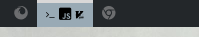
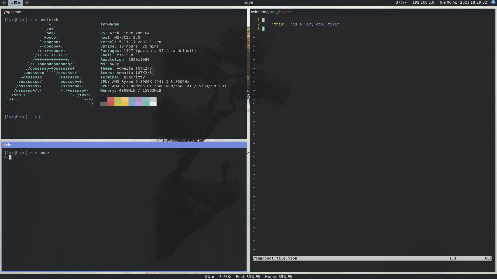

# Swayest Workstyle

An executable similar to [workstyle](https://github.com/pierrechevalier83/workstyle).

The main difference between this and `workstyle` is that this supports exact app names instead of only generic titles.

Meant to work best/only with Wayland and Sway.

It also supports a fallback icon for when it couldn't match an App.

This ensures that icons are always valid based on the application being run instead of soly relying on application title. (Does not work well with browers, since you can type anything and it will show up in title name)

Your workspace shall never contain an empty icon again!

**An example of what it does (using waybar which also hides the workspace index):**


<br />


## Installation

### Cargo

```
cargo install sworkstyle
```

### Arch Linux

You can install it manually or use a aur helper like Yay.

```
yay -S sworkstyle
```

## Usage

```
sworkstyle
```

## Sway Configuration

```
exec sworkstyle &> /tmp/sworkstyle.log
```

Note that since your workspaces will be renamed all the time, you should configure your keybindings to use numbered workspaces instead of assuming that the name is the number:
Prefer

```
    bindsym $mod+1 workspace number 1
```

over

```
    bindsym $mod+1 workspace 1
```

## Configuration

The main configuration consists of deciding which icons to use for which applications.

The config file is located at `${XDG_CONFIG_HOME}/sworkstyle/config.toml`. It will be generated if missing. Read the generated file. The syntax is in TOML and should be pretty self-explanatory.

When an app isn't recogised in the config, `sworkstyle` will log the application name as a warning.
Simply add that string to your config file, with an icon of your choice.

Note that the crate [`find_unicode`](https://github.com/pierrechevalier83/find_unicode/) can help find a unicode character directly from the command line. It now supports all of nerdfonts unicode space.

### Example Config

```toml
fallback = ''

[matching]
"github" = { type = "generic", value = "" }
"rust" = { type = "generic", value = "" }
"vim" = { type = "generic", value = "" }
"npm" = { type = "generic", value = "" }
"node" = { type = "generic", value = "" }
"yarn" = { type = "generic", value = "" }
"thunderbird" = ""
"Bitwarden" = ""
"Google-chrome" = ""
"Slack" = ""
"Code" = ""
"Alacritty" = ""
"Spotify" = ""
"firefox" = ""
```
